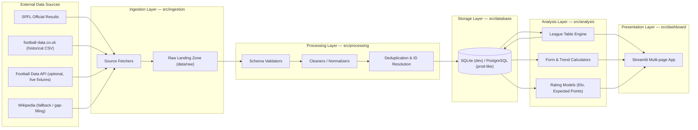
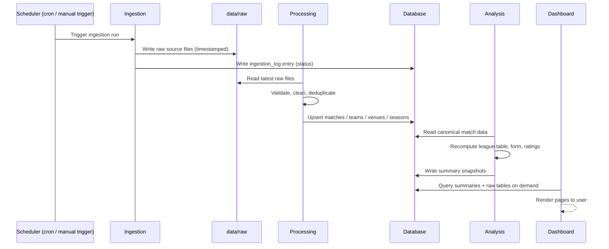

# Architecture

## 1. Purpose

This document describes the end-to-end system architecture for the Scottish Premiership Data Dashboard: its major components, how data flows between them, the design principles behind the chosen structure, and the rationale for key technology choices.

## 2. Design Principles

- **Separation of concerns** — ingestion, storage, analysis, and presentation are distinct layers with narrow interfaces, so any layer can be modified or replaced (e.g. swapping SQLite for PostgreSQL, or Streamlit for Dash) without rewriting the others.
- **Idempotent, replayable ingestion** — re-running ingestion for a given date range must not create duplicate records. Raw source data is preserved so the database can be rebuilt from scratch at any time.
- **Single source of truth** — all derived statistics (league tables, form, ratings) are *computed*, not manually entered, from the canonical `match` table. Nothing is hand-edited downstream of ingestion.
- **Reproducibility** — a fresh checkout, with a filled-in `.env`/`config.yaml` and a single ingestion run, must be able to reproduce the full dataset and dashboard state.
- **Small, inspectable pipeline** — the project favours a straightforward batch pipeline (fetch → validate → clean → load → compute → visualise) over premature use of orchestration frameworks (e.g. Airflow), given the modest data volume (a few thousand matches).

## 3. System Overview



## 4. Component Breakdown

### 4.1 Ingestion Layer (`src/ingestion/`)

Responsible for retrieving data from external sources and writing it, unmodified, into `data/raw/`. Each source has its own fetcher module so that individual sources can fail, be rate-limited, or be retried independently without affecting others. See [data_ingestion.md](data_ingestion.md) for full detail.

### 4.2 Processing Layer (`src/processing/`)

Reads raw files, validates them against expected schemas, resolves inconsistencies (e.g. differing team name spellings across sources), deduplicates records, and produces clean, normalized records ready for loading. Intermediate output is written to `data/interim/`; the final analysis-ready dataset is written to `data/processed/` before being loaded into the database.

### 4.3 Storage Layer (`src/database/`)

Owns the relational schema, migrations, and data access functions. SQLite is used for local development (zero setup, file-based); the schema is designed to be portable to PostgreSQL for a shared/production-like deployment. See [database_schema.md](database_schema.md).

### 4.4 Analysis Layer (`src/analysis/`)

Reads from the storage layer and computes derived, read-optimized outputs: point-in-time league tables, rolling form guides, home/away splits, Elo-style ratings, and expected-points models. Computed snapshots are written back to dedicated summary tables so the dashboard never needs to recompute expensive aggregates on every page load. See [analysis_methodology.md](analysis_methodology.md).

### 4.5 Presentation Layer (`src/dashboard/`)

A multi-page Streamlit application that queries the storage/analysis layers and renders interactive visualisations. See [visualisation_plan.md](visualisation_plan.md).

### 4.6 Cross-cutting: `src/utils/`

Shared, dependency-free helpers used across layers: configuration loading (`.env` + `config.yaml`), structured logging setup, date/season-window helpers, and team-name normalization lookups.

## 5. Data Flow (Typical Pipeline Run)



## 6. Technology Choices & Rationale

| Concern | Choice | Rationale |
|---|---|---|
| Language | Python 3.11+ | Rich ecosystem for data ingestion, analysis, and dashboarding |
| Local database | SQLite | Zero-config, file-based, ideal for a single-user local dashboard |
| Production-capable database | PostgreSQL (optional) | Same schema scales to a shared/hosted deployment if needed |
| ORM / data access | SQLAlchemy Core/ORM | Portable between SQLite and PostgreSQL without rewriting queries |
| Migrations | Alembic | Versioned, reviewable schema changes |
| Data validation | pandera (dataframe schemas) | Declarative validation of ingested/cleaned data shapes |
| Dashboard framework | Streamlit | Fast to build, native multi-page support, good for a data-focused single-purpose app |
| Charting library | Plotly (via Streamlit) | Interactive charts (hover, zoom, filtering) with good Streamlit integration |
| Scheduling (local) | OS-level cron / Windows Task Scheduler | No need for a dedicated orchestrator at this data volume |
| Testing | pytest + pandera + Streamlit AppTest | Matches the layered architecture; each layer is independently testable |
| Config management | `.env` (secrets) + YAML (non-secret settings) | Clear separation between secret and non-secret configuration |

See [environment_configuration.md](environment_configuration.md) for full configuration details and [testing_strategy.md](testing_strategy.md) for the testing approach per layer.

## 7. Folder Structure

```text
Scottish_Premiership_Data_Dashboard/
├── README.md
├── LICENSE
├── CONTRIBUTING.md
├── CHANGELOG.md
├── requirements.txt
├── requirements-dev.txt
├── pyproject.toml
├── .env.example
├── .gitignore
├── docs/
│   ├── architecture.md
│   ├── database_schema.md
│   ├── data_ingestion.md
│   ├── analysis_methodology.md
│   ├── visualisation_plan.md
│   ├── testing_strategy.md
│   ├── environment_configuration.md
│   ├── roadmap.md
│   └── assets/
├── config/
│   └── config.example.yaml
├── src/
│   ├── ingestion/       # One fetcher module per data source
│   ├── processing/      # Validators, cleaners, normalizers
│   ├── database/        # SQLAlchemy models, Alembic migrations, DAL
│   ├── analysis/        # League table, form, ratings, trend logic
│   ├── dashboard/       # Streamlit pages and shared UI components
│   └── utils/           # Config loading, logging, date/season helpers
├── data/
│   ├── raw/             # Immutable as-fetched data, partitioned by source + run date
│   ├── interim/         # Cleaned but not yet fully normalized data
│   └── processed/       # Final analysis-ready data (pre-load snapshot)
├── notebooks/           # Exploratory / ad-hoc analysis, not part of the pipeline
└── tests/
    ├── unit/
    ├── integration/
    └── fixtures/
```

**Rationale for `data/raw` → `data/interim` → `data/processed` staging:** this mirrors a standard medallion-style layout, keeps every transformation step inspectable and independently re-runnable, and ensures the original source data is never mutated in place.

## 8. Deployment Model (Planned)

The initial target is **local execution**: ingestion run on a schedule (cron/Task Scheduler), SQLite database on disk, Streamlit dashboard run locally (`streamlit run`). A future phase (see [roadmap.md](roadmap.md)) may introduce:

- A hosted deployment (e.g. Streamlit Community Cloud or a small container on a VPS) backed by PostgreSQL.
- A scheduled GitHub Actions workflow to run ingestion and commit/refresh the processed dataset or push to a hosted database.

No deployment code is included in this blueprint; this section documents the intended direction only.
