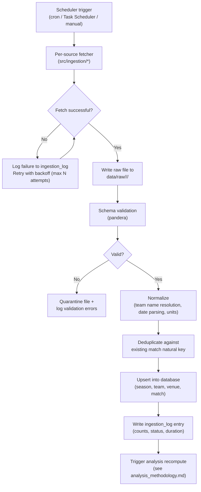

# Data Ingestion Plan

## 1. Objectives

- Retrieve Scottish Premiership fixture, result, and standings-relevant data reliably and reproducibly.
- Preserve raw source data unmodified for auditability and replay.
- Normalize inconsistent representations (team names, date formats) into the canonical schema defined in [database_schema.md](database_schema.md).
- Detect and handle new, corrected, or postponed fixtures without creating duplicates.

## 2. Data Sources

| Source | Type | Data Provided | Update Frequency | Notes / Licensing |
|---|---|---|---|---|
| **SPFL official website / results pages** | HTML | Authoritative fixtures & results, matchweek grouping | As matches are played | Primary source of truth for current season; scraping must respect the site's terms of use and `robots.txt`, with a conservative request rate |
| **football-data.co.uk** | CSV download | Historical full-season results (multiple past seasons), goals, match dates | Updated periodically during a season | Free for personal/research use; long-standing, widely used dataset for backfilling historical seasons |
| **Football data API** (e.g. a provider such as API-Football or football-data.org) | REST API (JSON) | Fixtures, live/near-live results, sometimes venue and matchweek metadata | Real-time to daily, depending on plan | **Optional** enhancement; requires an API key (see [environment_configuration.md](environment_configuration.md)); subject to the provider's rate limits and licensing terms |
| **Wikipedia season pages** | HTML tables | Fallback/gap-filling for results or venue metadata missing from other sources | As edited | Used only as a last-resort fallback; lower trust priority in conflict resolution |

**Source priority for conflict resolution:** SPFL official → paid/free API → football-data.co.uk (for historical seasons) → Wikipedia (fallback only). The `match.source` column always records which source last wrote a given row, and `match_date`/score corrections from a higher-priority source overwrite lower-priority ones.

This project is independent and non-commercial; all sources are used under their respective public/personal-use terms, and attribution is provided in the README.

## 3. Ingestion Architecture

## 4. Pipeline Stages

### 4.1 Fetch
Each source has an isolated fetcher responsible only for retrieving data and saving it verbatim (CSV/HTML/JSON) to `data/raw/<source>/<run_timestamp>/`. Fetchers never write to the database directly. Failures in one source's fetcher must not block others.

### 4.2 Validate
Raw data is checked against a declarative schema (expected columns/fields, types, and value ranges — e.g. `home_goals >= 0`, `match_date` within the season's date range) before any further processing. Invalid files are quarantined (moved to `data/raw/<source>/_quarantine/`) with a logged reason rather than silently dropped or force-loaded.

### 4.3 Normalize
- **Team name resolution**: each source's raw team name string is mapped to a `team.canonical_key` via a maintained lookup table (`config/team_aliases.yaml`), so `"St Mirren"`, `"St. Mirren FC"`, and `"ST MIRREN"` all resolve to the same `team_id`.
- **Date/time normalization**: all dates parsed to ISO 8601 and stored as `DATE`.
- **Status inference**: matches with a recorded score are marked `played`; future fixtures without a score are `scheduled`; sources' postponement/abandonment flags (where available) map to `postponed`/`abandoned`.

### 4.4 Deduplicate & Upsert
Records are upserted into `match` keyed on the natural key `(season_id, home_team_id, away_team_id, match_date)` (see [database_schema.md](database_schema.md#34-match)). An upsert either inserts a new row or updates score/status/`source`/`updated_at` on an existing row — it never creates a duplicate fixture.

### 4.5 Log
Every run writes a row to `ingestion_log` recording source, start/end time, status, and record counts, enabling ingestion health to be reviewed from the dashboard's admin/data-quality page (see [visualisation_plan.md](visualisation_plan.md#data-quality--admin-page)).

## 5. Scheduling

| Context | Cadence | Mechanism |
|---|---|---|
| In-season (matches being played) | Daily (e.g. once overnight after fixtures conclude) | Local cron / Windows Task Scheduler running the ingestion entry point |
| Off-season | Weekly, or manual | Same mechanism, reduced frequency |
| Historical backfill | One-off, manual trigger | Run once per newly added historical season |

No live/real-time (in-match) updates are planned for the MVP; the dashboard reflects results as of the last completed ingestion run.

## 6. Error Handling & Resilience

- **Retries**: transient network failures are retried with exponential backoff up to a configured maximum (see `config/config.example.yaml`).
- **Partial failure isolation**: if one source fails entirely, ingestion continues for the remaining sources; the run is marked `partial` in `ingestion_log` rather than failing outright.
- **Idempotency**: re-running ingestion for a date range already loaded is safe and produces no duplicate or corrupted data, due to the upsert strategy in §4.4.
- **Rate limiting**: HTML scraping and API calls are throttled to a conservative request rate (configurable delay between requests) to avoid overloading source sites and to respect API provider limits.

## 7. Data Lineage

Every `match` row retains its originating `source` and `ingested_at`/`updated_at` timestamps, and every ingestion run is recorded in `ingestion_log`, giving full traceability from a dashboard figure back to the specific run and source file in `data/raw/` that produced it.

## 8. Out of Scope (for MVP)

- Player-level statistics and lineups.
- In-play (live, minute-by-minute) updates.
- Betting-odds data.

These are noted as potential future extensions in [roadmap.md](roadmap.md).
