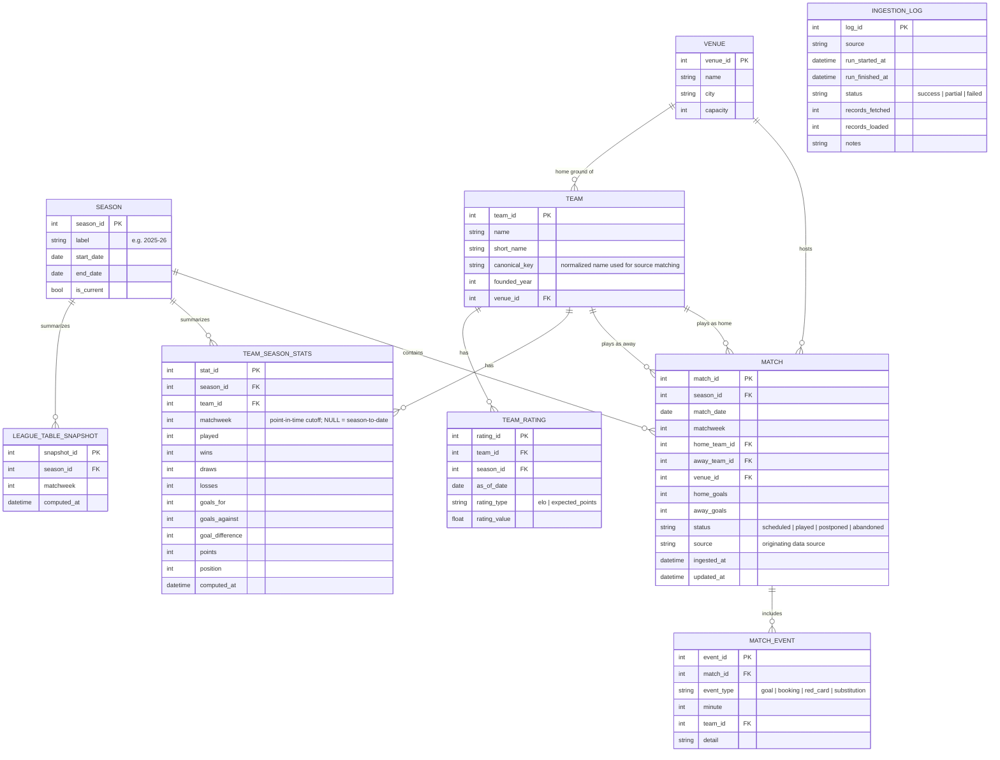

# Database Schema

## 1. Overview

The schema is designed around a single canonical fact table (`match`) with supporting dimension tables (`season`, `team`, `venue`) and derived/summary tables that are recomputed by the analysis layer rather than manually maintained. It targets SQLite for local development and PostgreSQL for a production-like environment, so it deliberately avoids engine-specific features.

## 2. Entity-Relationship Diagram

## 3. Table Definitions

### 3.1 `season`
Dimension table representing a single league season.

| Column | Type | Constraints | Notes |
|---|---|---|---|
| season_id | INTEGER | PK | Surrogate key |
| label | TEXT | UNIQUE, NOT NULL | e.g. `"2025-26"` |
| start_date | DATE | NOT NULL | |
| end_date | DATE | NULL | Nullable until season concludes |
| is_current | BOOLEAN | NOT NULL, DEFAULT FALSE | Exactly one row should be `TRUE` at a time (enforced at application/processing level) |

### 3.2 `team`
Dimension table for the 12 Scottish Premiership clubs (membership can change between seasons via promotion/relegation, so this table holds all teams observed historically, not just current-season members).

| Column | Type | Constraints | Notes |
|---|---|---|---|
| team_id | INTEGER | PK | Surrogate key |
| name | TEXT | NOT NULL | Official display name |
| short_name | TEXT | NULL | e.g. abbreviation used in compact table views |
| canonical_key | TEXT | UNIQUE, NOT NULL | Lower-cased, punctuation-stripped key used to reconcile naming differences across sources (e.g. `"st mirren"` vs `"St. Mirren"`) |
| founded_year | INTEGER | NULL | |
| venue_id | INTEGER | FK → venue.venue_id, NULL | Current home ground |

### 3.3 `venue`
Dimension table for stadiums/grounds.

| Column | Type | Constraints | Notes |
|---|---|---|---|
| venue_id | INTEGER | PK | Surrogate key |
| name | TEXT | NOT NULL | |
| city | TEXT | NULL | |
| capacity | INTEGER | NULL | |

### 3.4 `match`
Canonical fact table — one row per fixture.

| Column | Type | Constraints | Notes |
|---|---|---|---|
| match_id | INTEGER | PK | Surrogate key |
| season_id | INTEGER | FK → season.season_id, NOT NULL | |
| match_date | DATE | NOT NULL | |
| matchweek | INTEGER | NULL | Round/matchday number, where available from source |
| home_team_id | INTEGER | FK → team.team_id, NOT NULL | |
| away_team_id | INTEGER | FK → team.team_id, NOT NULL | `CHECK (home_team_id <> away_team_id)` |
| venue_id | INTEGER | FK → venue.venue_id, NULL | |
| home_goals | INTEGER | NULL | NULL until match is played |
| away_goals | INTEGER | NULL | NULL until match is played |
| status | TEXT | NOT NULL, DEFAULT `'scheduled'` | One of `scheduled`, `played`, `postponed`, `abandoned` |
| source | TEXT | NOT NULL | Which ingestion source last wrote this row |
| ingested_at | DATETIME | NOT NULL | First-seen timestamp |
| updated_at | DATETIME | NOT NULL | Last-modified timestamp |

**Uniqueness constraint:** `UNIQUE (season_id, home_team_id, away_team_id, match_date)` — the natural key used to deduplicate/upsert across ingestion runs and across sources.

### 3.5 `match_event` *(stretch — see [roadmap.md](roadmap.md))*
Optional fine-grained events (goals, cards, substitutions) if a source provides them. Not required for MVP league-table/form functionality.

| Column | Type | Constraints | Notes |
|---|---|---|---|
| event_id | INTEGER | PK | |
| match_id | INTEGER | FK → match.match_id, NOT NULL | |
| event_type | TEXT | NOT NULL | `goal`, `booking`, `red_card`, `substitution` |
| minute | INTEGER | NULL | |
| team_id | INTEGER | FK → team.team_id, NULL | |
| detail | TEXT | NULL | Free-text (player name, card colour, etc.) |

### 3.6 `team_season_stats` (derived/summary)
Recomputed by the analysis layer; never manually written. Supports both season-to-date rows (`matchweek IS NULL`) and point-in-time snapshots (`matchweek = N`) so the dashboard can show "table as it stood after matchweek N".

| Column | Type | Constraints | Notes |
|---|---|---|---|
| stat_id | INTEGER | PK | |
| season_id | INTEGER | FK → season.season_id, NOT NULL | |
| team_id | INTEGER | FK → team.team_id, NOT NULL | |
| matchweek | INTEGER | NULL | NULL = season-to-date |
| played, wins, draws, losses | INTEGER | NOT NULL | |
| goals_for, goals_against, goal_difference | INTEGER | NOT NULL | |
| points | INTEGER | NOT NULL | |
| position | INTEGER | NOT NULL | Rank within the snapshot |
| computed_at | DATETIME | NOT NULL | |

**Uniqueness constraint:** `UNIQUE (season_id, team_id, matchweek)`

### 3.7 `league_table_snapshot` (derived)
Lightweight index of which point-in-time tables have been computed and cached, used by the dashboard to list available "table as of matchweek N" views without scanning `team_season_stats`.

### 3.8 `team_rating` (derived)
Stores time-series rating values (Elo, expected points, etc.) so the dashboard can plot rating trends without recomputing them on every request. See [analysis_methodology.md](analysis_methodology.md#rating-models) for calculation details.

### 3.9 `ingestion_log`
Operational table recording each ingestion run for observability and debugging — not part of the analytical model.

## 4. Indexing Strategy

| Table | Index | Purpose |
|---|---|---|
| match | `(season_id, matchweek)` | Fast retrieval of a season's fixtures by round |
| match | `(home_team_id)`, `(away_team_id)` | Team-profile and head-to-head queries |
| match | `(match_date)` | Date-range filtering in the Match Explorer page |
| team_season_stats | `(season_id, matchweek)` | Fast lookup of a specific point-in-time table |
| team_rating | `(team_id, rating_type, as_of_date)` | Trend charts per team/rating type |

## 5. Views (Planned)

- **`current_league_table`** — a SQL view (or equivalently, a cached query) returning `team_season_stats` for the current season where `matchweek IS NULL`, ordered by points/goal difference, for the dashboard's default landing page.
- **`head_to_head`** — a view joining `match` on either team-pairing (home/away agnostic) to support the Head-to-Head comparison page.

## 6. Migration Strategy

Schema changes are managed with **Alembic**, versioned in `src/database/migrations/`. Each migration is additive and reversible where practical. The `match` table's natural-key uniqueness constraint is treated as a hard invariant; any change to it requires a documented backfill/dedup step before the migration is applied.

## 7. Data Retention & Mutability

- `data/raw/` files are treated as immutable and retained indefinitely (or per a documented retention window) to allow full pipeline replay.
- `match` rows are mutable only for `status` transitions (`scheduled` → `played`/`postponed`/`abandoned`) and score corrections sourced from a newer ingestion run — never manually edited.
- Derived tables (`team_season_stats`, `team_rating`, `league_table_snapshot`) are fully recomputable and can be truncated and rebuilt at any time without data loss.
