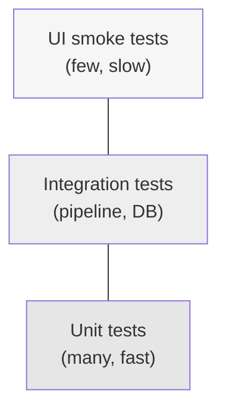

# Testing Strategy

## 1. Philosophy

Testing follows a standard pyramid shape, weighted toward fast, isolated unit tests, with a smaller layer of integration tests validating the pipeline end-to-end against fixture data, and light UI smoke testing on top. Each architectural layer (see [architecture.md](architecture.md)) is tested independently, matching the project's separation of concerns.

## 2. Tooling

| Concern | Tool |
|---|---|
| Test runner | `pytest` |
| Data/dataframe schema validation | `pandera` |
| Database fixtures | `pytest` fixtures + an in-memory/temp-file SQLite database per test session |
| Streamlit smoke testing | Streamlit's built-in `AppTest` framework |
| Coverage measurement | `pytest-cov` |
| Test data | Small, hand-curated fixture files in `tests/fixtures/` (not full production dumps) |

## 3. Test Layers

### 3.1 Unit Tests (`tests/unit/`)

Fast, isolated tests with no network access and no real database, covering:

- **Ingestion parsers**: given a small sample raw file (CSV/HTML snippet) per source, verify the parsed output matches expected fields — including malformed/edge-case input (missing score, unusual date format).
- **Team name resolution**: given known alias variants, verify correct `canonical_key`/`team_id` resolution; verify an *unrecognised* name raises/flags rather than silently creating a duplicate team.
- **Validation schemas**: `pandera` schemas correctly accept valid records and reject invalid ones (negative goals, missing required fields, out-of-range dates).
- **League table computation**: given a small fixed set of match results (fixture data), verify the computed table (points, GD, ranking, and tiebreaker ordering) matches a hand-calculated expected table — including a specific test case for a 3-way points/GD tie.
- **Form guide calculation**: verify rolling-window form output for teams with fewer matches than the window size (season-start edge case).
- **Rating models**: verify Elo update arithmetic against a hand-computed example (known pre-match ratings + known result → known post-match ratings); verify season carry-over regression formula.
- **Date/season-window utilities**: matchweek/split-fixture logic in `src/utils/`.

### 3.2 Integration Tests (`tests/integration/`)

Exercise multiple layers together against a temporary SQLite database and fixture raw files (never against live external sources):

- **End-to-end pipeline run**: fixture raw files → ingestion → validation → normalization → DB load → analysis recompute, asserting the final `team_season_stats` and `match` tables are correct.
- **Idempotency**: running ingestion twice against the same fixture data produces no duplicate `match` rows and an unchanged final state.
- **Upsert/correction handling**: a second ingestion run with a corrected score for an already-loaded match updates the existing row rather than inserting a new one.
- **Migration test**: Alembic migrations apply cleanly to an empty database and are reversible (`upgrade` then `downgrade` round-trip) where practical.

### 3.3 UI / Dashboard Smoke Tests (`tests/integration/` or a dedicated `tests/ui/`)

Using Streamlit's `AppTest`, against a fixture-seeded test database:

- Each page loads without raising an exception, for both a populated and an empty database state.
- Core interactive elements (season selector, team selector, matchweek slider) render and respond without error.
- These are **smoke tests**, not visual/pixel regression tests — they assert the app doesn't crash and key elements are present, not exact rendered appearance.

### 3.4 Data Validation Tests

Distinct from unit tests on parsing logic: these assert properties of the **data itself** once loaded, intended to also run as a lightweight post-ingestion check in production:

- No two `match` rows share the same natural key.
- Every `match.home_team_id`/`away_team_id` references an existing `team` row.
- `team_season_stats.played = wins + draws + losses` for every row (internal consistency).
- Sum of all teams' `points` in a completed season's final table is internally consistent with total match count (each played match contributes exactly 2 or 3 points to the pool).

## 4. Test Data Management

- `tests/fixtures/` holds small, hand-crafted sample files per source format (a handful of matches, including edge cases like a postponed fixture and a team-name variant) — not scraped/live data, and not committed production dumps.
- Fixture data is version-controlled since it is small and deterministic; this is distinct from `data/raw|interim|processed/`, which are gitignored (see [environment_configuration.md](environment_configuration.md)).

## 5. Coverage Targets

| Layer | Target |
|---|---|
| `src/processing/`, `src/analysis/` (core logic) | ≥ 90% line coverage |
| `src/ingestion/` (I/O-heavy, network-adjacent) | ≥ 70% line coverage (parsing/normalization logic covered; live network calls excluded) |
| `src/dashboard/` (UI) | Smoke-tested (page renders without error); not measured by line coverage |
| Overall project | ≥ 80% line coverage |

Coverage is a guardrail, not a goal in itself — tests are written to validate documented behaviour (this document and [analysis_methodology.md](analysis_methodology.md)) first.

## 6. Continuous Integration

Implemented in `.github/workflows/ci.yml` (Phase 2; see docs/roadmap.md), running on every pull request and every push to `main`:

1. Install dependencies (`requirements.txt` + `requirements-dev.txt`).
2. Run linting/formatting checks (`ruff check .`, `black --check .`, `mypy src tests`).
3. Run `pytest` (unit + integration + UI smoke tests) with coverage reporting.
4. Fail the build if coverage drops below 80% overall or any check fails (`--cov-fail-under=80`, matching the "Overall project" target in §5).

**Coverage, as actually achieved:** 90% overall (`[tool.coverage.run]` in `pyproject.toml`), against an `omit` list of `src/dashboard/*` (smoke-tested per §5, not line-coverage-tracked), the thin CLI entry points (`backfill_historical.py`, `fetch_spfl_current_season.py`, `run_pipeline.py`, `run_spfl_pipeline.py`, `run_daily_ingestion.py` - argparse plumbing over already-tested functions, live-network-dependent), and `backtest_ratings.py` (a validation report script per §6.3 above, not an automated test gate). `src/processing/` and `src/analysis/` sit at 90%+ per file except `team_aliases.py` (94%) and `normalize.py` (90%) - meeting the "core logic" target in §5. The two ingestion fetchers (`football_data_co_uk.py`, `spfl.py`) sit at 60% and 50% respectively rather than the §5 target of 70%: every pure/parseable function in both is tested, but neither is omitted, so the actual HTTP-calling functions - deliberately untested per §5's "live network calls excluded" - pull the file's raw percentage below the numeric target even though the *tested* logic's coverage is complete. Closing that gap would mean either mocking HTTP end-to-end (a new dependency and test-design shift not yet undertaken) or omitting the files outright (losing the incentive to keep adding pure-logic tests as these fetchers grow); left as a known, documented gap rather than force-fit.

Verified locally before this workflow was added: the full suite passes with `.env` and `config/config.yaml` removed (both gitignored - CI won't have them either), confirming no hidden dependency on local, uncommitted configuration. `config/team_aliases.yaml` is real, committed, version-controlled data (see docs/environment_configuration.md section 6), not a secret, so it's present in CI like any other checked-out file.

## 7. Regression Testing

Whenever the analysis methodology changes (e.g. a rating-model constant is retuned, per [analysis_methodology.md](analysis_methodology.md#63-model-validation)), the fixture-based league-table and rating unit tests act as the regression safety net — any unintended change in computed output for the fixed fixture dataset will fail a test rather than silently changing dashboard figures.
